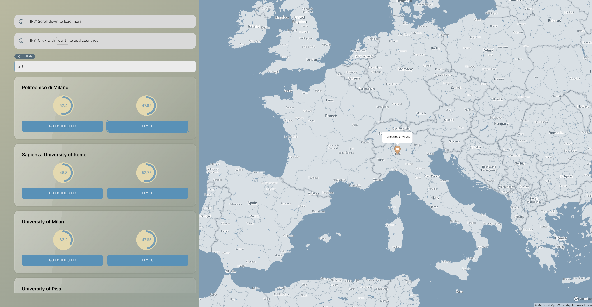

# Features

- Clear overview of institutional information.
- Enhanced institution search functionality powered by [MeiliSearch](https://www.meilisearch.com/).
  - [Index](https://github.com/zezhehh/academics-core/blob/main/sync/structs/document.go): Includes offered subjects, names, countries, and country codes.
- Simply click on the map to filter institutions by country.
- Admin view for direct data modification in the user interface.
